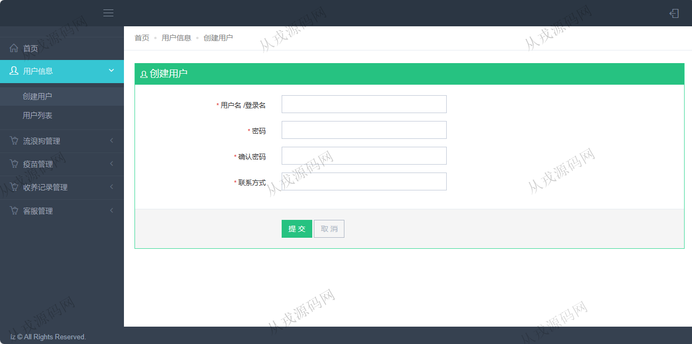

<h1 align="center">139.流浪动物管理系统</h1>

 获取sql文件 QQ: 386869957 QQ群: 377586148 

 [更多源码项目: 从戎源码网](https://armycodes.com/) 

## 简介

> 本代码来源于网络,仅供学习参考使用!
>
> 提供1.远程部署/2.修改代码/3.设计文档指导/4.框架代码讲解等服务
> 
> 用户端访问地址：http://localhost:8080/ssm-adopt/frontPage/login.jsp
> 
> 用户：jack 123456
> 
> 管理后台访问地址：http://localhost:8080/ssm-adopt/
> 
> 管理员：2018 123456
> 

## 项目介绍
基于ssm的流浪动物管理系统：前端 jsp、jquery，后端 maven、springmvc、spring、mybatis；角色分为管理员、用户；集成收养狗狗、送养狗狗、疫苗管理等功能于一体的系统。

## 功能介绍

### 用户

- 基本功能：登录、退出
- 网站首页：主导航栏，轮播图，文章推荐，关键词搜索，标签云，点击排行，最新文章，站长推荐，最新评论
- 文章：文章列表展示，文章详情，评论，回复
- 收养狗狗：流浪狗列表展示，收养
- 送养狗狗：用户可以将自己的狗狗发布在系统中，填写狗狗资料，其他用户看到可以收养

### 管理员

- 用户管理：用户信息的增删改查，按用户名模糊查询
- 流浪狗管理：流浪狗信息的增删改查，图片上传，接种
- 疫苗管理：疫苗信息的增删改查，流浪狗接种疫苗列表查询
- 收养记录查询：用户收养记录查询，送养人信息管理
- 留言：用户在前台留言，管理员从管理后台查询用户的留言信息，进行回复或删除操作

## 环境

- <b>IntelliJ IDEA 2021.3</b>

- <b>Mysql 5.7.26</b>

- <b>Tomcat 7.0.73</b>

- <b>JDK 1.8</b>

## 运行截图

